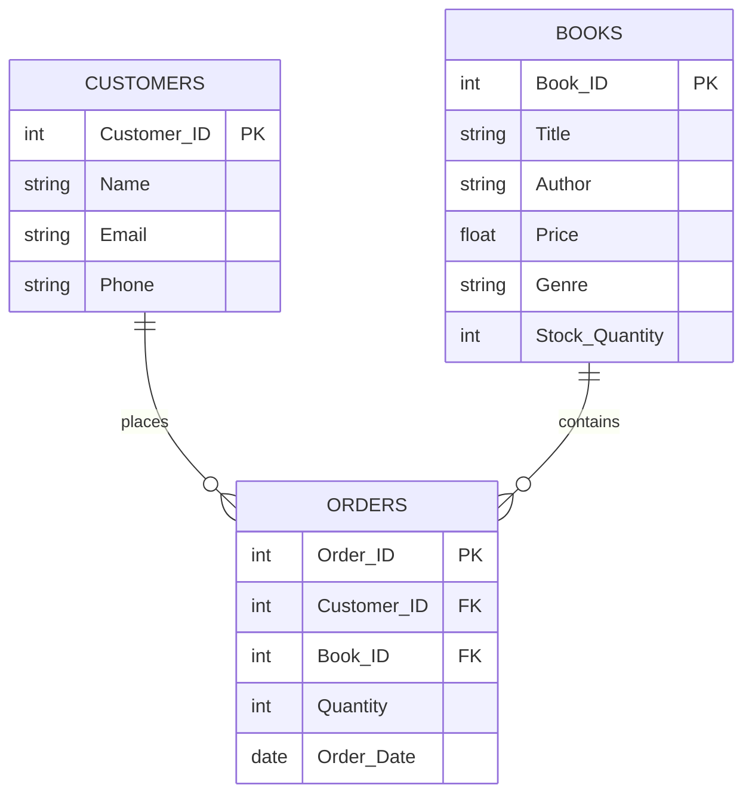

# SQL-Bookstore-Analysis
# 📚 Online Bookstore Database Project

## Overview
This project focuses on building a relational database for an online bookstore using SQL. The goal is to take raw data from 3 CSV files (`Books`, `Customers`, and `Orders`), structure them into connected database tables, and run queries to analyze sales and inventory.

---

## Tech Stack & Tools
* **Database Engine:** MySQL
* **Development Environment:** MySQL Workbench

### Core SQL Concepts Applied
* Creating tables and defining relationships (DDL)
* Importing data from CSV files
* Basic data retrieval and multi-table `JOIN` operations
* Grouping and Data Aggregations (`COUNT`, `SUM`, `AVG`)

---

## Database Schema (ERD)

This repository structures 3 core CSV data files into a connected relational model using Primary Keys (PK) and Foreign Keys (FK).

##  Key Business Questions Addressed

By executing the queries in this repository, the following business objectives are accomplished:

1) Retrieve the total number of books sold for each genre.
2) Find the average price of books in the "Fantasy" genre.
3) Find the most frequently ordered book.
4) Find the customer who spent the most on order.
